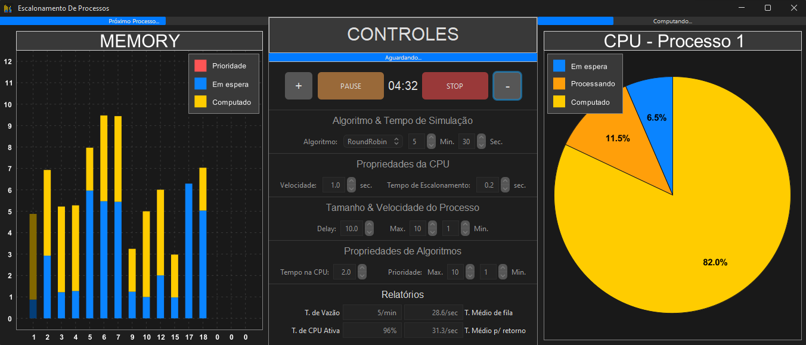
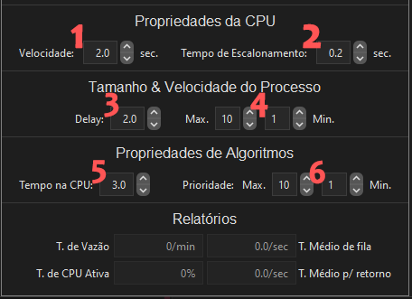

# Escalonamento de Processos

#
### Para executar o projeto, no terminal digite:
(Utilizando o Java 17)
```shell
java -jar ProcessScheduling.jar
```

### Ou apenas execute o START.bat
#
## Informações sobre o projeto:
### Controles (Simulação Inativa)

- 1 - Aumenta o tamanho da memória (Max: 30)
- 2 - Começa a simulação
- 3 - Diminui o tamanho da memória (Min: 10)
- 4 - Seleciona o algoritmo de escalonamento
- 5 - Tempo em minutos de simulação
- 6 - Tempo em segundos de simulação
### Controles (Simulação Ativa)

- 1 - Barra de escalonamento de processos
- 2 - Aumenta a velocidade com que os processos são gerados na memória
- 3 - Pausa a simulação
- 4 - Reseta a simulação
- 5 - Diminui a velocidade com que os processos são gerados na memória
### Propriedades:

- 1 - Velocidade da cpu
- 2 - Tempo de escalonamento (No exemplo 0.1 de ida e 0.1 de volta)
- 3 - Delay que os processos são gerados na memória
- 4 - Tamanho dos processos na memória
- 5 - Tempo que os processos ficarão na memória
- 6 - Variação de prioridades dos processos
### Projeto feito por:
- Pedro Lucas Nascimento Moreira Machado
- Kaio Stefan Campos Nunes
- Caio Pereira Lapa
- João Victor Mascarenhas de Faria Santos
#

Tempo codando: [](https://wakatime.com/badge/user/d7827dc4-ebb9-4e8b-9941-d7c602e4b639/project/fffbf56a-b5f7-489c-a64a-c98dc1416304)